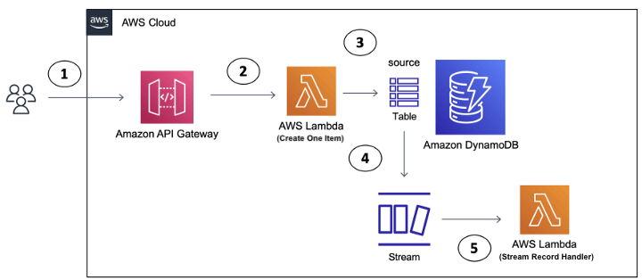
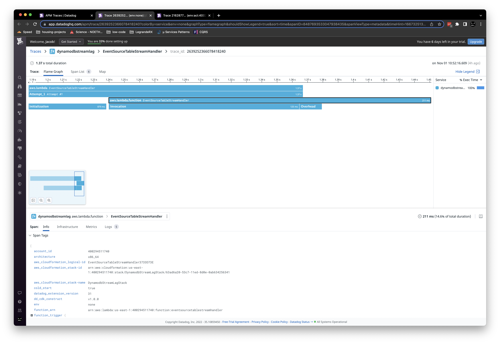
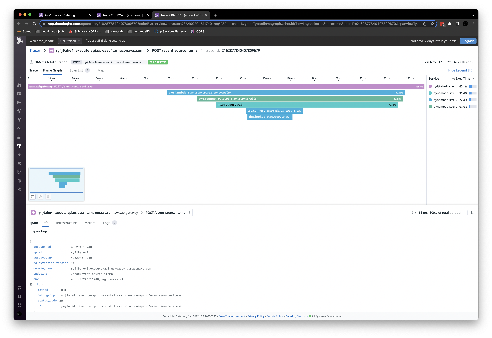
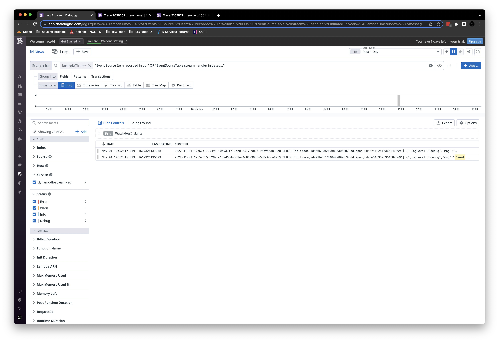

# Using DynamoDB Streams and Lambda for realtime systems

This document is a review of the below Bid Processing Engine design.

TODO Draw complete architecture including:
- Client bid creates/updates
- API VenueEvent, VenueListing changes
    - Including AWS Step Functions
- DynamoDB stream records & Lambda Triggers
- Zoom into the Bid Processing Engine
- Bidding Notification/update propagation to clients

## Findings / Deliverables

### Task 1. Understand the motivation and scope of the initiative

The motivation is to create a minimalistic, highly decoupled engine to process bids on generic items in multiple scenarios such as sequential sales (simulcast), on demand events, non sequential sales (dot auction), etc...

With this highly decoupled approach a lot of the functionality required to sell items in some of the formats listed above can be ignored, i.e; a/v, asset management, event management,etc. The scope of this project is what I am calling the "Bid Processing Engine" (BPE) as it is intended to consume bids, maintain the state/statistics of Items for sell and record the lifecycle (start/end times) of a group of items (known as a VenueEvent).

In regards to context; this solution aims to be cloud native with no human interaction (meaning all bidding is processed/approved without human involvement). This last part may be something that needs to be re-evaluated when approaching simulcast events like exist in the auto industry today (items clerked by humans).

See `Understanding the motivation` under the `Review play by play (The Approach)` section below for more details on the main data model.

### Task 2. Review current Design and Implementation

Note: this section is still in progess and only reflects the deep dive into the DynamoDB streams portion of the system.

#### Using DynamoDB Streams for Real Time Bid Processing

Digging through the AWS documentation you will find that AWS claims that ["DynamoDB Streams writes stream records in near-real time..."](https://docs.aws.amazon.com/amazondynamodb/latest/developerguide/Streams.html) and ["...AWS Lambda service polls the stream for new records four times per second. When new stream records are available, your Lambda function is synchronously invoked."](https://docs.aws.amazon.com/amazondynamodb/latest/developerguide/Streams.Lambda.html). This essentially means there is 250ms + (time to write stream records) delay potential. 

For context lets step back and think of each phase of the bid processing time:

- Bid submission time
    - From client button click across App Sync (Websocket/GraphQL) to triggered Lambda
- Bid storage time
    - Authorization, request validation, processing, write to DynamoDB
- DynamoDB Stream lag time
    - Time to write the stream record, 250ms polling interval of the lambda trigger, Lambda startup time
- Bid processing time
    - Processing of the stream records (the bids)
- Bid change notification time
    - Broadcast across App Sync (Websocket/GraphQL) to all connected clients

We know we are currently targetting < 300ms for the total bid processing time. Considering the `DynamoDB Stream lag time` has a 250+ms potential delay we have to keep Bid submission time, Bid storage time, Bid processing time, and Bid change notification time under 50ms to 100% gaurantee we meet the target. It is arguable that in the real world the full 250+ms delay potential will average out but it will not be consistent.

I have developed a `Dynamo DB Streams Prototype` (mentioned below) that gives us an isolated way to explore the `DynamoDB Stream lag time`. In its current state it is enough to confirm that the use of DynamoDB streams and Lambda triggers may prove to be too costly (time wise) to hit the 300ms desired bid processing time.

The `Dynamo DB Streams Prototype` source can be viewed in the monster-doodles repo [here](https://github.com/MonsterMakes/monster-doodles/tree/main/packages/exploration/dynamodb-stream-lag)

Another item to note here is it is unclear from the AWS documentation how the stream records are providded to the triggered Lambdas in retry/error scenarios. It is clear that if the lambda fails during processing the processed stream records will be passed to the next lambda invocation. A couple questions that should be followed up on are:

- Does the subsequent invoked lambda get any new records in addition to the previous records?
- If a invoked lambda takes longer than the 250ms polling interval will another be invoked?
    - See below mentions of concurrency and shards.
                
The above questions should be able to be answered using the `Dynamo DB Streams Prototype` as a foundation.

## Recommendations

Note: this section is still in progess and only reflects the deep dive into the DynamoDB streams portion of the system.

At this moment I would not recommend exploring alternative architectures instead I would suggest that the < 300ms bid processing time be softened. I would hold on setting that new target until after a performance review of each of the bid processing phases mentioned above. At that point a new goal could be set including some variability for the `DynamoDB Stream lag time`. In other words if we know we can keep Bid submission time, Bid storage time, Bid processing time, and Bid change notification time under 500ms we can set the target at <750ms with real world conditions being closer to 500ms.

## Potential Follow-ups

- Continue to scale/load test the dynamoDB streams portion of the design
- Alter the `Dynamo DB Streams Prototype` to answer the concurrency and error handling questions noted above
- Review the VenueEvent, VenueListing, and ItemBid entities and related datamodel questions.
- Performance/Design review each of the phases
    - Bid submission time
    - Bid storage time
    - Bid processing time
    - Bid change notification time
- Review the use of GraphQL
    - We know graphQL has overhead in processing requests and large increase in developer cognitive load
    - Totally makes sense when you need flexibility on the client side (Is that the need here?)
        - This is usually the case with buggy legacy backend systems or when teams or organized by layers (Backend, Frontend, etc...)
- Review the use of AWS Step functions
    - Fantastic solution for ETL pipelines or out of band parts of the system (e.g admin processes).
    - It appears to be used to orchestrate lambdas to process VenueEvent, and VenueListing changes
- Review the "Resolvers" and the auth strategy on the websocket
    - Specifically the pros/cons of authorizing the socket upon connection vs every message
- Review Telemetry / Monitoring strategy
    - High visibility into the performance and actions taken within the Bid Processing Engine is a MUST!
- Continue noting any Coupling / Bad practices
    - EXTREMELY LOW PRIORITY:
        - I see some authentication environment variable names tied to specific products
- Review the system from an "illities" point of view
    - see current "ilities" notes below

## Notes on the "ilities"

Note: this section is a work in progess. The system has not been reviewed from an "ilities" pov explicitly. Below you will find notes that were made in passing.

- Supportability
    - Personal/Subjective notes
        - Heavy use of frameworks
            - Terraform, Typescript, SAM, Rush, Bugsnag
            - Frameworks are fantastic for speed to market and can have huge maintainability gains if needs align with framework goals
                - time will tell if the needs align with framework goals
            - Heavy use of Frameworks can cause significant cognitive load and in some cases steep learning curves
                - I would review the use of Terraform, Rush and Bugsnag

- Quality / Testability
    - tests appear to be in place but no reference to code quality gates or how to run the test suite...
        - Digging into the github actions should explain how to run the tests
    - did not see any SAAS

- Maintainability
    - It appears to be 
        - trunk branching strategy
        - builds/releases based on git commits
            - Developers triggering production releases without gates is a SOX, SOC no no

- Developer Experience
    

---

## Review play by play (The Approach)

Note: This section will take you through the exact steps I took to come to the above undertandings. You can think of this as my raw notes.

### 1. Understanding the motivation

During the 10/18/2022 kick off meeting Dan shared the vision of creating a minimilistic Bid Processing Engine that could support simulcast, adhoc bidding and in the future as a headless bidding engine with client integrations into facebook and other platforms. The scope is what I am calling the "Bid Processing Engine" (BPE) as it is intended to have no knowledge of items, bidders, events, sequential/non sequential, etc... Its entire life is to simply process bids everything else is passed in. 

Using the context from that discussion and a little digging in the code the BPE owns 1 enttiy (ItemBid) and mutates state in 2 others (VenueEvent,VenueListing), see below (note this is looking at the Data Model from the BPEs point of view)

- VenueEvent
  - represents a group of items for sale
  - keeps track of statistics/state of the bidding that has taken place across the grouped items
  - has many VenueListings
  - Read Only information (Owned by someone else)
    - `id`, `plannedEndTime`, `metadata`
  - Write information (BPE owns it)
    - `startTime`, `endTime`/`actualEndTime` (see below), `venueEventInfo`
  - NOTES:
    - not sure who owns 
        - `projectedEndTime`
        - `startTime`
        - `endTime`
        - `actualEndTime`
    - Was this an accident or is there some subtle difference between `endTime` and `actualEndTime`.
    - I would have expected to see a `plannedStartTime`
    - What does `timestamp` represent
        - is this a createdTime? a lastUpdatedTime?
    - Why is `metadata` a string?
        - I would have expected an object which is a great way to add extensibility through a "cargo car" 
    - For the type of information captured in `venueEventInfo` need to be careful to not be too prescriptive here. This would be a good place for decoupling... Possibly a cargo car or some other extension technique.

- VenueListing (a.k.a an Item)
    - represents an item being sold
    - has many ItemBids
    - Read Only information (Owned by someone else)
        - `id`, `venueEventId`, `bidIncrement`, `openingPrice`, `floorPrice`, `buyNowPrice`, `metadata`
    - Write information (BPE owns it)
        - `currentBid`,`numberOfBids`,`numberOfBidders`,`floorPriceMet`,`timeRange.actualEndTime`
    - NOTES:
        - Similar questions/confusion around ownership of event times, but transposed to `timeRange`
            - startTime, endTime, plannedEndTime, projectedEndTime, actualEndTime
        - Might look at grouping the statistics (computed values) from the static values for clarity/extensibility purposes
            - Statistics/computed (currentBid, numberOfBids,numberOfBidders, floorPriceMet
        - The ownership of `state`, and `endedStatus` is a little confusing from a pure dataModel point of view...
            - I think this is really due to the confusion around the who owns the xTime questions above
        - Why `state.Ended` and `endedStatus`?
        - What does `timestamp` represent
            - is this a createdTime? a lastUpdatedTime?
        - Why is `metadata` a string?
            - I would have expected an object which is a great way to add extensibility through a "cargo car" 

- ItemBid
    - represents a bid to buy on an item
    - ordered by ???
        - I dont see any order or sequencing in `itemBid.entity.ts` 
        - it may be in the terraform code but that framework has a high cognitive load cost and does not have a linear learning curve so developers that have not paid that price cannot gleam info like this quickly/easily.
    - Immutable information (BPE owns it but creates only never updates!!!)
        - `id`, `venueListingId`,`bid`,`userId`,`bidderId`,`bidderIp`,`bidType`,`state`,`status`,`receivedAt`
    - NOTES:
        - Need to make sure the handling of currency is something you want the BPE to deal with!
            - For example; How do you deal with exchange rates?
            - Other platforms have punted on this problem entirely...
        - I assume `bidderIp` is being used for arbitration purposes (to further identify the user)
            - This should be looked at is a fallible way to identify the user, meaning it works in some scenarios but not all
        - What does `timestamp` represent
            - is this a createdTime? a lastUpdatedTime?
        - `receivedAt` is a string, is this a javascript epochTime (num of ms not seconds)?
        - `GSI1SK` appears to be a computed field for a secondary index in DynamoDB
            - I am new to dynamoDB so the purpose of this property is unclear to me 
            

### 2. Code Exploration

After getting a high level understanding of what was going on from the team (Dan, Glenda) and reviewing the Performance Diagram I dug into ski-masks codebase.

Here was my intial reactions:

- LOVE LOVE LOVE the high level developer day 0 docs... Best I have seen in a codebase in a long while
- So far I am seeing some very good programming practices 12 factor etc...
- This project definitely suffers from the AWS cloud native learning curve problem.
    - Without hand holding from another engineer there is a significant amount of time needed in building a mental model due to the leveraging of all the frameworks/services/tools etc...
    - Developer level documentation on this would significantly help developer onboarding

After reading through the code I am comfortable with the overall design and decided to start switching gears to zoom into performance bottlenecks and scaling, here was the short list of questions/ research items I came up with:

1. The dynamoDB streams appear to be used for decoupling the bid mutations from the client updates
    - This makes a lot of sense but can it handle the performance / scale required?
2. Need to understand the App Sync (websocket layer)
    - How are updates propagated?
    - Troubleshooting/Tracing???
3. Need to understand the motivation for choosing GraphQL for such a simple service?
    - We know graphQL has overhead in processing requests and large increase in developer cognitive load
    - Totally makes sense when you need flexibility on the client side (Is that the need here?)
        - This is usually the case with buggy legacy backend systems or when teams or organized by layers (Backend, Frontend, etc...)
4. I see mentions of AWS Step functions, what is the role?
    - Need to make sure this is being leveraged in ETL or out of band parts of the system.
    - AWS step function are not intended to be used in real time scenarios
5. Need to investigate the "Resolvers" and the auth strategy on the websocket
    - Probably not much overhead so will investigate this last

### 3. Research and Tech Investigation

After exploring the documentation and researching the use case on the web I beleive the largest performance/design concern is the use of DynamoDB Streams to provide real time updates to the "bidCreated"... I am making some assumptions that need to be validated on the DynamoTable. I am assuming a TableBids with each item being a new bid.

The key takeaways I found in my research around using Lambdas with the DynamoDB Streams:
- its polling based. 
    - Best case it will invoke the lambda 4 times a second (every 250ms). 
    - I am not sure what happens if the execution of the lambda takes longer than 250ms (no info in the docs or that I could find online). 
    - I also am not sure what happens if the lambda fails does it invoke the lambda again with the same records or all the failed records plus any new ones?
- The stream records are processed "near real time"
    - I saw multiple "mentions" on stack overflow that you can expect "sub second" 
        - This thread https://stackoverflow.com/questions/41965786/how-real-time-dynamodb-stream-is
            - 1 guy experienced a 30 minute outage (suspected AWS outage)
            - 1 guy states that you can expect the lambda to be invoked less than a second after the write
                - The 250ms polling interval would seem to check out here
- Shards play a role in the lag but... It is not yet clear to me if this can be controlled. Lots of mentions about them being ephemeral and controlled by AWS
    - https://stackoverflow.com/questions/56781598/lambda-trigger-lag-through-dynamodb-streams
    - Another assumption I am making here is that we want the records to be processed sequentially so the client gets the bids in order
    - So many concurrent lambdas would cause more application code to keep things in order on the client side

What I decided to do next was develop an isolated test harness to play these scenarios out and "prove" if this design is capable of handling the scale and meeting the desired 300ms bidd processing time.

Goals:

1. Is the "Near real time" nature of DynamoDB Streams with Lambda triggers a 300ms goal killer?
2. Build a simplified prototype with Distrubuted Tracing and telemetry to get visibility into latency/lag across the AWS black boxed services (DynamoDB Table, DyanmoDB Streams, Lambda)
    - if we prove this design can handle sub 300ms then we can tack on the bid place request (apollo), and client updated (apollo) parts
        - Keep in mind both these "hops" will have that lovely ISP Last mile network hops involved. 
            - Which of course is a constraint we cant control...
            - can we mitigate it or do we have to accept it?

### 4. DynamoDB Streams prototype

Using AWS CDK some very simple Lambdas and dynamoDB tables and Datadog (https://www.datadoghq.com/) I was able to get a prototype up and running with basic instrumentation quickly. Source can be seen at [monster-doodles](https://github.com/MonsterMakes/monster-doodles)

*DynamoDB Streams Lag Prototype Design:*

To simulate what is happening in the current design I needed something to put an item in a dynamoDB table (3) and then a lambda to handle the stream records (5). The performance/timing I am first interested in is from the moment the Table is updated to the moment the lambda begins to handle the stream records. 

The distributed tracing (APM) was not as out of the box as I hoped so I took a more low tech approach to get a feel for the timing. What I did was essentialy made the Lambdas add timestamps in the structured logging and then manually correlated and extracted the results.

Here is what I found simulating a bid every few seconds:

- Bid 1
    - Created In DB: 10/25/2022, 11:43:59 AM
    - Stream Handler Triggered: 10/25/2022, 11:44:03 AM
    - Lag Time: **3.062 seconds**
- Bid 2
    - Created In DB: 10/25/2022, 12:07:35 PM
    - Stream Handler Triggered: 10/25/2022, 12:07:38 PM
    - Lag Time: **2.469 seconds**
- Bid 3
    - Created In DB: 10/25/2022, 12:29:48 PM
    - Stream Handler Triggered: 10/25/2022, 12:29:51 PM
    - Lag Time: **2.664 seconds**
- Bid 4
    - Created In DB: 10/25/2022, 12:29:51 PM
    - Stream Handler Triggered: 10/25/2022, 12:29:53 PM
    - Lag Time: **1.967 seconds**
- Bid 5
    - Created In DB: 10/25/2022, 12:29:55 PM
    - Stream Handler Triggered: 10/25/2022, 12:29:56 PM
    - Lag Time: **0.661 seconds**
- Bid 6
    - Created In DB: 10/25/2022, 12:29:58 PM
    - Stream Handler Triggered: 10/25/2022, 12:29:58 PM
    - Lag Time: **0.548 seconds**

This was using all the defaults that came with the AWS CDK, I am sure we could decrease the delay if we do some tuning. That said this gives me enough ammunition to continue the exploration. 

Next up: "Add distributed tracing across steps 1-5 above"
Goal:
I want to start simulating different "bidding" activity and quickly see performance results. Once this is in place we can start to make performance adjustments and see what gains we get.

### 5. Distributed Tracing in the DynamoDB Streams prototype

As stated above the goal was to get better visibility into the `DynamoDB Stream lag time` without having to manually correlate traces or metadata in logs. After working through the documentation and working with Datadog customer support it appears the APM/Tracing approach wont work as there is no direct connection between step 3 and 5. AWS offers no mechanism to correlate the stream record lambda trigger to the DB mutation spans/trace. I suspect other telemetry tools like New Relic may run into the same problem.

Here are the 2 isolated APM traces that make up steps 3-5 in the diagram above.

Here is an example of isolating the application logs to the start/end of the `DynamoDB Stream lag time` phase. Note the LAMBDATIME epoch column.
