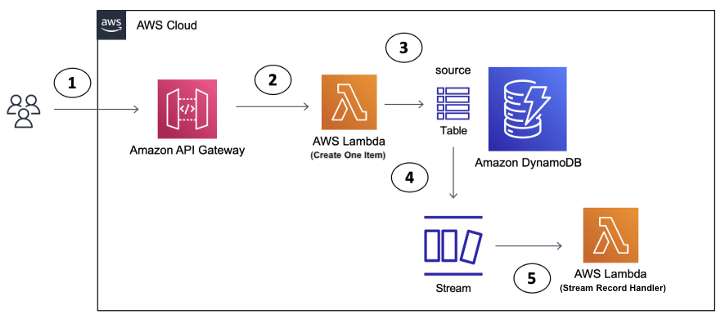

# Using DynamoDB Streams and Lambda for realtime systems

This document is a formal review of the below architectural design. The main goal is to keep all mutations to be processed in less than 300ms (from client initiation to client(s) reciept of mutation).

TODO Draw complete architecture

## Summary of Findings

- AWS claims that DynamoDB streams with AWS Lambda Triggers are "near real time"
    - Near real time is mainly affected by:
        - Transport and Authorization
            - Be this API gateway and its Authorizers or App Sync and resolvers... Either way need to minimize the time involved here
        - Lambda start up/execution time
            - both the DB mutation side and the handler that consumes the Stream Records
        - Dynamo DB Stream Consumption
            - DB Table Mutations are captured as Stream Records and buffered. Every 250ms a Lambda will be triggered and drain the buffer.
                - This means we have a 250ms delay potential (I believe this is a non starter)
            - In Error scenarios the documentation is unclear on how the previously processed stream records are handled
                - need to run tests, I suspect if a lambda processes multiple stream records and then fails it will be the responsibility of the subsequent ran lambda to figure out where it left off and recover
    - See https://docs.aws.amazon.com/amazondynamodb/latest/developerguide/Streams.Lambda.html for more details

## Recomendations / Follow Ups

***TODO!!!***

## Review play by play (The Approach)

### Code Exploration

After getting a high level understanding of what was going on from the team (Dan, Glenda) and reviewing the Performance Diagram I dug into Auction Edge ski-masks codebase.

Here was my intial reactions:

- LOVE LOVE LOVE the high level developer day 0 docs... Best I have seen in a codebase in a long while
- So far I am seeing some very good programming practices 12 factor etc...
- This project definitely suffers from the AWS cloud native learning curve problem.
    - Without hand holding from another engineer there is a significant amount of time needed in building a mental model due to the leveraging of all the frameworks/services/tools etc...
    - Developer level documentation on this would significantly help developer onboarding

After reading through the code I am comfortable with the overall design and decided to start switching gears to zoom into performance bottlenecks and scaling, here was the short list of questions/ research items I came up with:

1. The dynamoDB streams appear to be used for decoupling the bid mutations from the client updates
    - This makes a lot of sense but can it handle the performance / scale required?
2. Need to understand the App Sync (websocket layer)
    - How are updates propagated?
    - Troubleshooting/Tracing???
3. Why GraphQL for such a simple service?
    - We know graphQL has overhead in processing requests and large increase in developer cognitive load
    - Totally makes sense when you need flexibility on the client side (Is that the need here?)
        - This is usually the case with buggy legacy backend systems or when teams or organized by layers (Backend, Frontend, etc...)
4. I see mentions of AWS Step functions, what is the role?
    - Need to make sure this is being leveraged in ETL or out of band parts of the system.
    - My understanding of AWS step function is it is not intended to be used in real time scenarios
5. Need to investigate the "Resolvers" and the auth strategy on the websocket
    - Probably not much overhead so will investigate this last

### Reasearch and Tech Investigation

After exploring the documentation and researching the use case on the web I beleive the largest performance/design concern is the use of DynamoDB Streams to provide real time updates to the "bidCreated"... I am making some assumptions that need to be validated on the DynamoTable. I am assuming a TableBids with each item being a new bid.

The key takeaways I found in my researcharound using Lambdas with the DynamoDB Streams:
- its polling based. 
    - Best case it will invoke the lambda 4 times a second (every 250ms). 
    - I am not sure what happens if the execution of the lambda takes longer than 250ms (no info in the docs or that I could find online). 
    - I also am not sure what happens if the lambda fails does it invoke the lambda again with the same records or all the failed records plus any new ones?
- The stream records are processed "near real time"
    - I saw multiple "mentions" on stack overflow that you can expect "sub second" 
        - This thread https://stackoverflow.com/questions/41965786/how-real-time-dynamodb-stream-is
            - 1 guy experienced a 30 minute outage (suspected AWS outage)
            - 1 guy states that you can expect the lambda to be invoked less than a second after the write
                - The 250ms polling interval would seem to check out here
- Shards play a role in the lag but... It is not yet clear to me if this can be controlled. Lots of mentions about them being ephemeral and controlled by AWS
    - https://stackoverflow.com/questions/56781598/lambda-trigger-lag-through-dynamodb-streams
    - Another assumption I am making here is that we want the records to be processed sequentially so the client gits the bids in order
    - So many concurrent lambdas would cause more application code to keep things in order on the client side

What I decided to do next was develop an isolated test harness to play these scenarios out and "prove" if this design is capable of handling the scale and meeting the desired 300ms bidd processing time.

Goals:

1. Is the "Near real time" nature of DynamoDB Streams with Lambda triggers a 300ms goal killer?
2. Build a simplified prototype with Distrubuted Tracing and telemetry to get visibility into latency/lag across the AWS black boxed services (DynamoDB Table, DyanmoDB Streams, Lambda)
    - if we prove this design can handle sub 300ms then we can tack on the bid place request (apollo), and client updated (apollo) parts
        - Keep in mind both these "hops" will have that lovely ISP Last mile network hops involved. 
            - Which of course is a constraint we cant control...
            - can we mitigate it or do we have to accept it?

### DynamoDB Streams prototype

Using AWS CDK some very simple Lambdas and dynamoDB tables and Datadog (https://www.datadoghq.com/) I was able to get a prototype up and running with basic instrumentation quickly. Source can be seen at [monster-doodles](https://github.com/MonsterMakes/monster-doodles)

*DynamoDB Streams Lag Prototype Design:*

To simulate what is happening in the current design I needed something to put an item in a dynamoDB table (3) and then a lambda to handle the stream records (5). The performance/timing I am first interested in is from the moment the Table is updated to the moment the lambda begins to handle the stream records. 

The distributed tracing (APM) was not as out of the box as I hoped so I took a more low tech approach to get a feel for the timing. What I did was essentialy made the Lambdas add timestamps in the structured logging and then manually correlated and extracted the results.

Here is what I found simulating a bid every few seconds:

- Bid 1
    - Created In DB: 10/25/2022, 11:43:59 AM
    - Stream Handler Triggered: 10/25/2022, 11:44:03 AM
    - Lag Time: **3.062 seconds**
- Bid 2
    - Created In DB: 10/25/2022, 12:07:35 PM
    - Stream Handler Triggered: 10/25/2022, 12:07:38 PM
    - Lag Time: **2.469 seconds**
- Bid 3
    - Created In DB: 10/25/2022, 12:29:48 PM
    - Stream Handler Triggered: 10/25/2022, 12:29:51 PM
    - Lag Time: **2.664 seconds**
- Bid 4
    - Created In DB: 10/25/2022, 12:29:51 PM
    - Stream Handler Triggered: 10/25/2022, 12:29:53 PM
    - Lag Time: **1.967 seconds**
- Bid 5
    - Created In DB: 10/25/2022, 12:29:55 PM
    - Stream Handler Triggered: 10/25/2022, 12:29:56 PM
    - Lag Time: **0.661 seconds**
- Bid 6
    - Created In DB: 10/25/2022, 12:29:58 PM
    - Stream Handler Triggered: 10/25/2022, 12:29:58 PM
    - Lag Time: **0.548 seconds**

This was using all the defaults that came with the AWS CDK, I am sure we could decrease the delay if we do some tuning. That said this gives me enough ammunition to continue the exploration. 

### Next up: "Add distributed tracing across steps 1-5 above"
Goal:
I want to start simulating different "bidding" activity and quickly see performance results. Once this is in place we can start to make performance adjustments and see what gains we get.

---
TODO

## The "Ilities" Review

- Personal/Opinion based notes
    - Lots of "Magic" in this code base
        - Terraform, Typescript, SAM, Rush, Bugsnag

- Testing / Quality
    - tests appear to be in place but no reference to code quality gates or how to run the test suite...
        - I will dig into the github actions next, this should tell me how to test things

- CI/CD
    - It appears to be 
        - trunk branching strategy
        - builds/releases based on git commits
            - Developers triggering production releases without gates is a SOX, SOC no no

- Hunches/TODOs
    - I need to understand the role of dynamoDB streams
        - I am guessing this is the pub/sub mechanism
    - Need to understand the websocket layer
    - I would like to understand why GraphQL for such a simple service
    - Need to investigate the "Resolvers" and the auth strategy on the websocket
    - If AWS Step functions are in the middle of bid processing I suspect performance/scale issues

- Coupling / Bad practices
    - EXTREMELY LOW PRIORITY:
        - I see some environment variable names tied to "Auction Edge"